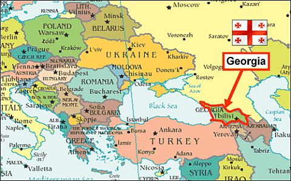
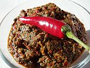
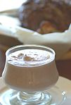
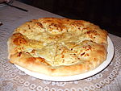
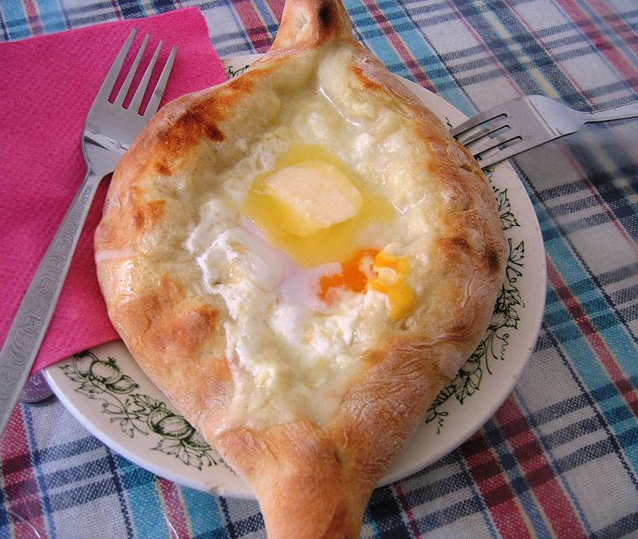
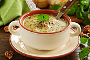
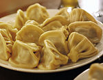
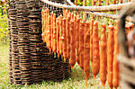
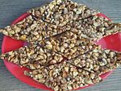

= [big blue]#**Kuchnia gruzińska**#

* https://llisowska.github.io/docs/[HTML5 – kuchnia gruzińska].

*Gruzja* - państwo położone na pograniczu Europy i Azji, w Kaukazie Południowym.

[cols=1*]
|===
|Gruzja:

|===
[cols=2*]
|===

|Powierzchnia
|69 700 km²

|Stolica
|Tbilisi

|Język urzędowy
|gruziński

|Ustrój polityczny
|demokracja
|Liczba ludności
|3 718 200
|Waluta
|1 lari = 100 tetri (GEL)
|===

*Kuchnia gruzińska* zajmuje szczególne miejsce w gruzińskiej tradycji i jest częścią tożsamości dzisiejszych Gruzinów. Łagodny i zróżnicowany klimat Gruzji, zapewnia obfitość i różnorodność płodów rolnych, w tym wielu aromatycznych przypraw.

W ciepłym słońcu dojrzewają soczyste pomidory, arbuzy, melony, winogrona a także karalioki (szaron) i dorodne bakłażany. Z kolei górskie hale dostarczają baraniny oraz setek gatunków sera. Dzięki temu narodowa kuchnia szczyci się bogactwem potraw. Dzięki charakterystycznym dodatkom, takim jak orzechy włoskie, czosnek, ocet, nasiona granatu i aromatyczne zioła, potrawy gruzińskie uzyskują swój unikatowy smak, a kuchnię gruzińską jedyną w swoim rodzaju. Znamienne jest używanie do potraw orzechów włoskich utartych na miękką masę. Znajdziemy je w sosach, farszach, zupach, a nawet w klasycznych sałatkach, z pomidorem, ogórkiem i zieleniną.

Prawdopodobnie część kuchni gruzińskiej ma swoje korzenie w Indiach. Chleb po gruzińsku i w hindi nazywa się dokładnie tak samo – puri, a gruziński piec tone pochodzi od hinduskiego pieca tandoor. Te podobieństwa to najprawdopodobniej dziedzictwo Mongołów, którzy najpierw okupowali Indie, a potem przybyli na Kaukaz, przynosząc tam przy okazji tradycje kulinarne wcześniej podbitych ziem.

<https://www.poezja-smaku.pl/kuchnia-gruzinska/>

<http://bonavita.pl/kuchnia-gruzinska-charakterystyka-tradycje-przepisy>

== SOSY I PRZYPRAWY

** *Adżika* – ostra pasta z czerwonej papryki.
** *Chmeli-suneli* – aromatyczna mieszanka przypraw.
** *Saciwi* – pasta z orzechów z przyprawami. Podawana na zimno. Dodatek do wielu mięs, ryb i dań warzywnych.
** *Tkemali* – aromatyczny sos produkowany ze śliwek i przypraw. Podawany przede wszystkim do mięs.

== Przepis

<https://www.kwestiasmaku.com/przepis/sos-adzika>

== PRZEKĄSKI

** *Chaczapuri* – zapiekany placek nadziewany serem, to najpopularniejsze gruzińskie danie; podaje się go w różnych wariacjach, w zależności od regionu.
** *Adżapsandali* – danie wegetariańskie składające się z bakłażana, ziemniaków, pomidorów, papryki i przypraw.
** *Kuczmaczi* – danie z wątróbki, serc i żołądków z orzechami i posypanymi na górę nasionami granatu.
** *Kupati* – kiełbasa wyrabiana z wieprzowiny, z dodatkiem soli, pieprzu, cebuli, czosnku a także mieszanki przypraw chmeli-suneli.
** *Lobiani* – ciasto chlebowe z nadzieniem z fasoli.
** *Lobio* – potrawa z fasoli, która prawie w każdej rodzinie wykonywana jest według innego przepisu. Z reguły zawiera ona kolendrę, orzechy włoskie, czosnek i cebulę.
** *Mczadi*  – placki z mąki kukurydzianej, tradycyjnie spożywane wraz z lobio i serem.
** *Mudżudżi* – danie na zimno z wieprzowiny w galaretce. Składniki zawierają mięso wieprzowe (ogony, uszy, nogi) marchew, ocet, czosnek, cebule, zioła, korzenie, liście laurowe, ziele angielskie i cynamon.
** *Badridżani* – potrawa ze smażonego bakłażana faszerowanego saciwi – czyli przyprawioną pastą z orzechów.
** *Pchali*  – danie z różnymi posiekanymi i mielonymi warzywami (z bakłażanów, kapusty, szpinaku, fasoli lub buraków) i połączone z orzechami włoskimi, octem, cebulą, czosnkiem, nasionami granatu i ziołam.
** *Tolma* – to bakłażany, zielone pomidory lub papryka nadziewane mięsem lub pastą orzechową przyprawioną nasionami granatu oraz aromatycznymi ziołami.

== Przepis

<http://kulinarni.tvn.pl/przepisy/przepis-chaczapuri,1104.html>

== DANIA GŁOWNE

** *Charczo* – gęsta zupa gulaszowa. Do mięsa dodaje się ryż, cebulę, czosnek, kolendrę, ostrą paprykę, sól, pieprz, liść laurowy oraz mieszankę przypraw uccho-suneli.
** *Czanachi*  – danie z gulaszu jagnięcego oraz z pomidorów, bakłażanów, ziemniaków, botwy i czosnku.
** *Czakapuli* – gulasz z kotletów jagnięcych lub cielęciny, z dodatkiem cebuli, czosnku, soli, liści estragonu, sosu tkemali, białego wina wytrawnego, mieszanych świeżych ziół.
** *Czachochbili* – pikantna zupa wołowa z duszonym kurczakiem, pomidorami, sosem pomidorowym, ostrą papryką, czosnkiem, kolendrą, liściem laurowym, solą i pieprzem.
** *Chinkali* – pierogi o charakterystycznym kształcie „sakiewek”, z pogrubieniem na szczycie, którego zwykle się nie jada. Faszeruje się je sosem-rosołem oraz wieprzowym lub wołowym mięsem.
** *Mcwadi* – gruzińska nazwa na szaszłyk. Mięso (wołowina, wieprzowina lub baranina) pokrojone na kawałki i nabite na metalowe pręty piecze się na grillu.
** *Chaszlama* – danie z gotowanej wołowiny. We wschodnich, górskich regionach Gruzji (Tuszetia i Chewsuretia) danie przyrządza się z baraniny. Do mięsa dodaje się liście laurowe, czarny pieprz, białą cebulę, czosnek pietruszkę i sól.
** *Kurczak Tabaka* – kurczak, który smażony jest na tradycyjnej patelni tapa. Danie jest często doprawiane czosnkiem i tradycyjnymi gruzińskimi sosami.
** *Kubdari* – placek z farszem mięsnym i przyprawami. Może być zarówno z wołowiny lub wieprzowiny, ale najbardziej popularna wersja używa obu rodzajów. Ważne aby było to mięso krojone a nie mielone.

== Przepis

<https://www.przyslijprzepis.pl/przepis/charczo-2>

<http://gotowaniecieszy.blox.pl/2016/09/Chinkali-przepis.html>

== DESERY

** *Czurczchela* – nawleczone na nitkę orzechy laskowe zatopione w cieście, które powstaje z gęstego soku z winogron.
** *Gozinaki* – słodkie danie z prażonych orzechów włoskich, cukru i miodu. Przygotowuje się je na Nowy Rok.

== Przepis

<http://weganon.pl/2016/03/gruzinska-czurczchela-2.html>

<http://obliczagruzji.monomit.pl/przepisy-kuchni-gruzinskiej/gozinaki-przysmak-zaklinajacy-szczescie>
